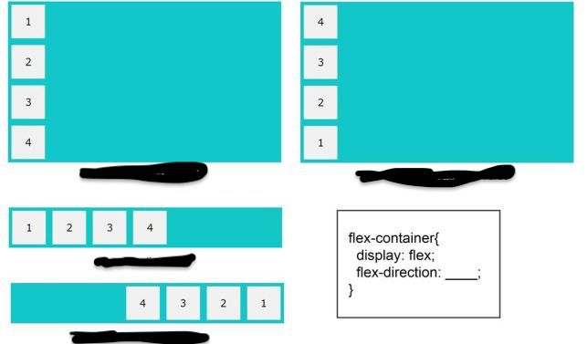

### What is z-index?

Z-index is a CSS property that specifies the stacking order of an element along the z-axis (perpendicular to the screen). It is used to control the vertical stacking order of elements that overlap on a web page.

### Why do we even need it? Where will you use it?

When multiple elements overlap in a web page, the z-index property determines the order in which they are stacked. Elements with a higher z-index value will be displayed on top of elements with a lower z-index value. This property is crucial for controlling the visual hierarchy and layering of elements on a webpage.

### What is the best practice of using it?

```
    .box {
      width: 100px;
      height: 100px;
      position: absolute;
    }

    .red-box {
      background-color: red;
      top: 50px;
      left: 50px;
      z-index: 1;
    }

    .blue-box {
      background-color: blue;
      top: 80px;
      left: 80px;
      z-index: 2;
    }

    .green-box {
      background-color: green;
      top: 110px;
      left: 110px;
      z-index: 3;
    }
```

### what is flexbox? Write the code to implement the following with flexbox and html.



Flexbox, or the Flexible Box Layout, is a layout model in CSS designed to make the creation of complex layouts more efficient and predictable. It provides an easy way to distribute space along a single axis (row or column) and handle the alignment of items in a container

We can implement the above patter with below CSS code:

````
/* Row reverse */
.container {
 list-style-type: none;
 border: 1px solid black;
 background-color: aqua;
 padding: 0;
 margin: 0;
 display: flex;
 flex-direction: row-reverse;
}

li {
 border: 1px solid black;
 margin: 0.5rem;
 padding: 0.5rem;
}

/* Column reverse */
.container {
 list-style-type: none;
 border: 1px solid black;
 background-color: aqua;
 padding: 0;
 margin: 0;
 display: flex;
 flex-direction: column-reverse;
}

li {
 border: 1px solid black;
 margin: 0.5rem;
 padding: 0.5rem;
}
```

### How can you align a div element in the center of the screen using flexbox?

We can align a div element as below

```
body {
display: flex;
justify-content: center; 
align-items: center; 
height: 100vh; 
margin: 0; 
}
```

### 4. What are the differnet properties of flex box. Explain each one of them

The main properties of Flexbox are applied to the parent container (flex container) to control the layout of its child elements (flex items). Here are the key Flexbox properties.

`display (flex | inline-flex):` Defines a flex container. It can be set to flex for a block-level container or inline-flex for an inline-level container.

```
.flex-container {
display: flex;
}
```

`flex-direction (row | row-reverse | column | column-reverse):` Specifies the direction of the main axis, determining the direction in which the flex items are placed.

```
.flex-container {
flex-direction: row; 
}
```
